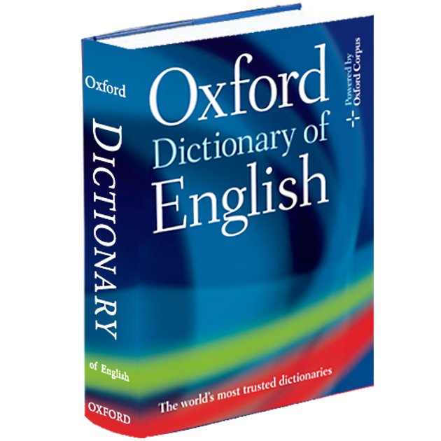

# Dictionary-isEnglishWords
This repository has the project english_words, it allows to find all of the English words in a given string.

## 📝 Description
The idea is the project has a dictionary that returns boolean true if the string passed to it is an English word, return
false otherwise.

## 🤖 Using Dictionary
This project has unit test with JUNIT, where you can test the mock designed. 
It works:
1. Create a mock for the class Dictionary
2. Create the cases when the function isEnglishWords is called for true.
3. Create instance of Dictionary
4. Define the input word
5. Invoke the function that find English words
6. Create the asserts to validate the tests

## 💻 Datos técnicos

The application was created using JAVA 8 and the package manager MAVEN. The project has a class named Dictionary with the
method isEnglishWord, it was mocked. We had created the auxiliary class WordFinder to find the English words in the original
input. And finally, we have a class WordFinderTest to test the project functionality, in this test we mocked the method 
isEnglishWord in the class Dictionary and we prove the cases for an example input, and possibles words.